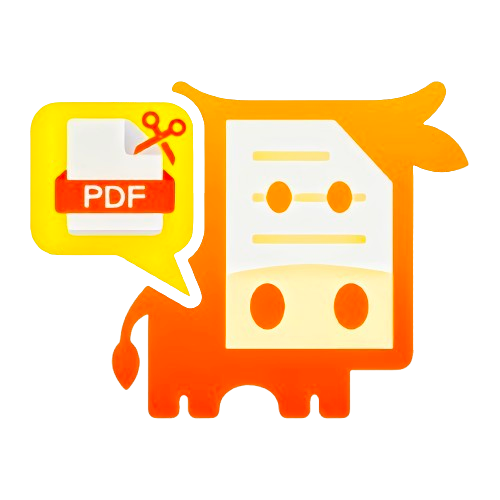

# MuPDF-Crop-Kit

> 基于 `MuPDF.js` 实现的 PDF 文件 A3 转 A4 小工具。
>
> 博客：[MuPDF＋Tauri的PDF切割小工具](https://juejin.cn/post/7451252126255382543?share_token=2e9ce7a2-f354-495a-bdf6-017beef9d98f)

## 项目简介

`MuPDF-Crop-Kit` 是一个基于 `MuPDF.js`、`React`、`Vite` 和 `Tauri` 开发的小工具，用于将 PDF 文件从 A3 纸张大小转换为 A4 纸张大小。它具有以下特点：

- **免费使用**：无需任何费用；
- **无需后台服务**：可以直接在浏览器中运行，无需依赖服务器；
- **高性能**：利用 WebAssembly (WASM) 技术，提供高效的文件转换性能；
- **轻量级桌面应用**：通过 Tauri 打包成桌面软件，安装包体积小，方便部署；
- **开源项目**：欢迎社区贡献代码和建议，共同改进工具。

## 使用教程

使用本工具非常简单，只需几个步骤即可完成 PDF 文件的转换：

1. 打开工具界面；
2. 选择需要转换的 A3 PDF 文件；
3. 点击转换按钮；
4. 下载转换后的 A4 PDF 文件。

## 安装与运行

### 浏览器版

- 直接访问网页链接（[MuPdf-Crop-Kit](https://mupdf-convert-kit.vercel.app/)）。

### 桌面版

- 下载并安装 Tauri 打包的桌面应用（[Release tauri-x64-exe-0.1.0 · HyaCiovo/MuPdf-Crop-Kit](https://github.com/HyaCiovo/MuPdf-Crop-Kit/releases/tag/tauri-x64-exe-0.1.0)）；
- 使用源码自行打包需要的安装包。

## 替代方案

如果在使用过程中遇到问题或需要更多功能，可以尝试以下在线工具：
- [Split PDF Down the Middle A3 to A4 Online](https://www.sejda.com/split-pdf-down-the-middle)：每小时可以免费转换3次，作者亲测好用👍。

## 项目贡献

欢迎开发者和用户为项目贡献代码或提出改进建议。可以通过以下方式参与：

- 提交 Issue 或 Pull Request；
- 联系作者：
  - QQ：849385638；
  - Email：zhujiruo@foxmail.com。

## 许可证

本项目遵循 MIT 许可证，详情请参阅 [LICENSE](./LICENSE) 文件。
