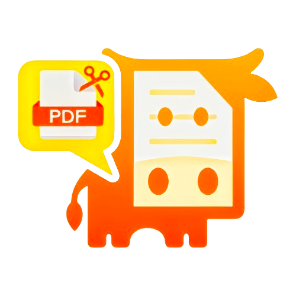

# MuPDF-Crop-Kit

> 一个基于 MuPDF.js 的 PDF 裁切工具，专注于将 A3 页面快速拆分为两个 A4 页面。

[在线体验](https://mupdf-crop-kit.vercel.app/) · [桌面版发布页](https://github.com/HyaCiovo/MuPdf-Crop-Kit/releases/tag/tauri-x64-exe-0.1.0) · [项目文章](https://juejin.cn/post/7451252126255382543?share_token=2e9ce7a2-f354-495a-bdf6-017beef9d98f)



## 项目简介

MuPDF-Crop-Kit 是一个面向本地文档处理场景的小工具，使用 `MuPDF.js + WebAssembly` 在浏览器端完成 PDF 读取、页面渲染和裁切，不依赖后端服务。

项目同时提供：

- **Web 版本**：适合直接打开网页即用
- **Tauri 桌面版**：适合打包为 Windows 桌面应用分发
- **本地处理**：文件处理在本地完成，更轻量、更适合敏感文档场景

## 功能特性

- 支持上传 PDF 并预览原始页面
- 支持将单个 A3 页面拆分为两个 A4 页面
- 支持两种拆分模式：
  - **Vertical**：左右拆分，适合常见 A3 双页转 A4
  - **Horizontal**：上下拆分，适合特殊排版文档
- 支持处理进度展示
- 支持生成结果预览并下载裁切后的 PDF
- 支持通过 Tauri 打包为桌面应用

## 技术栈

- **前端**：React 18、TypeScript、Vite
- **样式**：Tailwind CSS Vite 插件
- **提示交互**：react-hot-toast
- **PDF 能力**：MuPDF.js + WASM
- **桌面端**：Tauri 2 + Rust

## 使用方式

1. 打开应用
2. 上传需要处理的 PDF 文件
3. 选择拆分模式：
   - `Vertical`：左右切开
   - `Horizontal`：上下切开
4. 点击 `Crop Now`
5. 预览结果并下载生成的 PDF

## 本地开发

### 1. 安装依赖

你可以使用 `npm` 或 `pnpm`，任选一种即可：

```bash
npm install
```

或

```bash
pnpm install
```

### 2. 启动 Web 开发环境

```bash
npm run dev
```

默认开发地址：

```text
http://localhost:4000
```

### 3. 构建 Web 产物

```bash
npm run build
```

构建完成后，前端文件会输出到：

```text
build/
```

## Tauri 桌面打包

### 环境要求

在 Windows 上打包桌面版前，请先准备以下环境：

- Node.js
- Rust 工具链
- Visual Studio C++ Build Tools
- WebView2 Runtime

如果还没有安装 Rust，可执行：

```bash
winget install Rustlang.Rustup
```

安装完成后建议确认：

```bash
rustc -V
cargo -V
```

### 启动 Tauri 开发模式

```bash
npm run dev:tauri
```

### 构建桌面安装包 / exe

```bash
npm run build:tauri
```

构建产物通常位于：

```text
src-tauri/target/release/bundle/
```

## 项目结构

```text
MuPdf-Crop-Kit
├─ public/
├─ src/
│  ├─ assets/
│  ├─ components/
│  │  └─ mupdf/
│  │     ├─ dist/
│  │     ├─ index.tsx
│  │     └─ mupdf.worker.ts
│  ├─ App.tsx
│  └─ main.tsx
├─ src-tauri/
│  ├─ src/
│  ├─ icons/
│  └─ tauri.conf.json
├─ package.json
├─ vite.config.ts
└─ README.md
```

## 常用脚本

```bash
npm run dev
npm run build
npm run lint
npm run dev:tauri
npm run build:tauri
```

## 实现说明

- 页面裁切逻辑运行在 Web Worker 中，避免阻塞主线程
- 页面预览通过 MuPDF 渲染为 PNG，再在界面中展示
- 裁切后的 PDF 在 Worker 中生成并回传给前端下载
- Tauri 负责把前端构建产物包装成桌面应用

## 适用场景

- 扫描版 A3 试卷拆分为 A4
- 双页 PDF 文档拆分为单页
- 需要本地处理且不想上传文档到第三方服务的场景

## 替代方案

如果你不想本地部署，也可以尝试在线工具：

- [Split PDF Down the Middle A3 to A4 Online](https://www.sejda.com/split-pdf-down-the-middle)

## 贡献方式

欢迎提交 Issue 或 Pull Request 来改进这个项目。

如果你有想法、建议或使用反馈，也可以联系作者：

- GitHub: [HyaCiovo](https://github.com/HyaCiovo)
- QQ: 849385638
- Email: zhujiruo@foxmail.com

## 许可证

本项目基于 [MIT License](./LICENSE) 开源。
